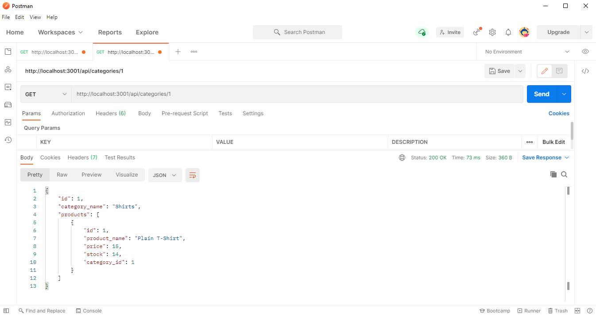

# 13 Object-Relational Mapping (ORM): E-Commerce Back End

[](https://opensource.org/licenses/MIT)

## Description

This is the back end for an e-commerce site that includes a functional Express.js API to use Sequelize to interact with a MySQL database.

Here's the link to my walkthrough video that demonstrates the functionality of the e-commerce back end:  
[_E-Commerce Back End Project Walkthrough Video!_](https://drive.google.com/)

## Table of Contents

- [Installation](#installation)

- [Usage](#usage)

- [License](#license)

- [Mock-Up](#mock-up)

- [Questions](#questions)

## Installation

To install necessary dependencies, run the following command:

```
npm i
```

## Usage

To launch the application, run the following command:

```
npm start
```

To seed data to your database so that you can test your routes, run the following command:

```
npm run seed
```

## License

This project is licensed under the MIT license.  
https://opensource.org/licenses/MIT

## Mock-Up

The following image shows the application's GET route to return a single category being tested in Postman:



The following images shows the application's POST, PUT, and DELETE routes for categories being tested in Postman:


## Questions

If you have any questions about the repo, open an issue or contact me directly at karenroh@hotmail.com.  
You can find more of my work at [kroh1031](https://github.com/kroh1031).
